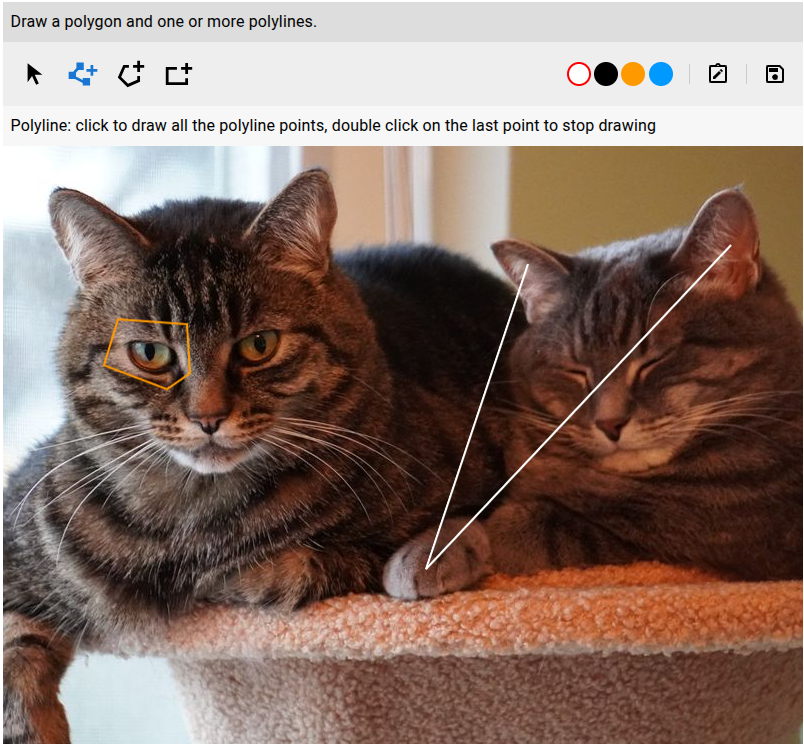

# React Cam ROI

> Still in development!

This is a react component which lets you draw regions of interest (ROI) over images, manage metadata and import/export everything.

Metadata are dynamic information that can be attached to the whole image or to each ROI. The ROI that can be drawn, and the metadata are controlled through a configuration object.



It provides one component: `RoiEditor` and one provider: `UiProvider`. The editor lets you draw regions of interest over a given image (url). Each has dynamic metadata attached (configured via api).
Export and import functionality is also provided.

Features:

- Autosizing of the editor: the canvas resizes to the size of the image, but it's also responsive, so if the container width is smaller, then the canvas is resized accordingly keeping the aspect ratio.
- Draw polylines, polygons and rectangles, change dimensions and rotate them.
- Support for dynamic metadata information attached to each shape and the whole image.
- Import and export shapes and metadata in json format.
- Highly customizable: shape colors, custom components and css classes.

## Installation

```
npm install @abidibo/react-cam-roi
```

## Usage

```ts
import { RoiEditor, UiProvider } from '@abidibo/react-cam-roi'
import { Typography, IconButton, Delete } from '@mui/material'

const MyComponent: React.FC = () => {
    const themMode = 'light'
    const config = {} // se below

    return (
        <UiProvider themeMode={themeMode} IconButton={IconButton} Typography={Typography} DeleteIcon={() => <Delete />}>
          <RoiEditor imageUrl={'https://placecats.com/800/600'} configuration={config} />
        </UiProvider>
    )
}
```

## Configuration

The configuration prop defines which kind and how many ROIs can be drawn, along with metadata information. Here the types definitions and an example:

```ts
// All types can be imported:
// import { Types } from '@abidibo/react-cam-roi'
// const { ToolEnum, ShapeType, DataTypeEnum, OperatorEnum, ConfigurationParameter, RoiConfiguration, Configuration } = Types

export const enum ToolEnum {
  Pointer = 'pointer',
  Polyline = 'polyline',
  Polygon = 'polygon',
  Rectangle = 'rect',
}

export type ShapeType = ToolEnum.Polyline | ToolEnum.Polygon | ToolEnum.Rectangle

export enum DataTypeEnum {
  Integer = 'int',
  Float = 'float',
  String = 'string',
  Boolean = 'bool',
}

export enum OperatorEnum {
  Lt = 'lt',
  Lte = 'lte',
  Gt = 'gt',
  Gte = 'gte',
  Eq = 'eq',
}

export type ConfigurationParameter = {
  codename: string
  label: string
  description: string
  unit: string
  type: DataTypeEnum
  options: { value: number | string | boolean; label: string }[]
  multiple?: boolean
  required: boolean
  value: number | string | boolean | null
}

export type RoiConfiguration = {
  role: string
  type: Omit<ShapeType, 'pointer'>
  multiplicity: {
    operator: OperatorEnum
    threshold: number
  }
  parameters: ConfigurationParameter[]
}

export type Configuration = {
  parameters: ConfigurationParameter[]
  rois: RoiConfiguration[]
}

export const configuration: Configuration = {
  parameters: [
    {
      codename: 'analytics_1', // internal code
      label: 'Analytics param 1', // to be shown in interface
      description: 'This is some descriptive text', // tooltip
      unit: 's', // unit
      type: DataTypeEnum.Integer, // int, float, string, bool
      options: [
        // if filled -> enum of types type
        {
          value: 7,
          label: 'Seven',
        },
        {
          value: 10,
          label: 'Ten',
        },
      ],
      required: true, // true | false,
      value: 10, // default value
    },
  ],
  rois: [
    {
      role: 'invasion_area', // analytics role, do not show in interface
      type: ToolEnum.Polygon,
      multiplicity: {
        // how many rois of this type can/should be created
        operator: OperatorEnum.Lt, // lt | lte | gt | gte | eq
        threshold: 2,
      },
      parameters: [
        {
          codename: 'threshold', // internal code
          label: 'Alert threshold', // to be shown in interface
          description: 'Threshold used for triggering alarms', // tooltip
          unit: '%', // unit
          type: DataTypeEnum.Integer, // int, float, string, bool
          options: [],
          required: true, // true / false,
          value: null, // default value
        },
      ],
    },
  ],
}
```

## Customization

You can customize many aspects of this library by using the `UiProvider`.

- You can customize both the styles and the components use in this library. The library provides default components with an interface compatible witu mui components.
- You can override them by using the `UiProvider`. But you can also use the default ones and just add your styling.
- You can pass a theme mode which is used by the default components to determine the color scheme. It is also used to define custom classes you can use for styling.
- You can define a primary color which is used for color or background of active elements.
- You can define custom strings used here and there.
- You can enable logs in the console by setting the `enableLogs` option to `true`.

```tsx
import IconButton from '@mui/material/IconButton'
import { UiProvider, RoiEditor } from 'react-cam-roi'

const MyView: React.FC = () => {
  return (
    <UiProvider themeMode={'dark'} IconButton={IconButton} primaryColor={'#1976d2'} enableLogs>
      <RoiEditor imageUrl={'whatever'} />
    </UiProvider>
  )
}
```

### UiProvider

Props and types are defined later in this document.

```ts
type UiContextType = {
  children?: React.ReactNode
  enableLogs: boolean
  themeMode: 'light' | 'dark'
  primaryColor: string
  Typography: React.FC<TypographyProps>
  Modal: React.FC<ModalProps>
  IconButton: React.FC<IconButtonProps>
  DeleteIcon: React.FC<DeleteIconProps>
  EditIcon: React.FC<EditIconProps>
  SelectIcon: React.FC<SelectIconProps>
  CopyIcon: typeof CopyIcon
  AnnotateIcon: typeof AnnotateIcon
  CloseIcon: typeof CloseIcon
  TextField: typeof TextField
  NumberField: typeof NumberField
  BoolField: typeof BoolField
  EnumField: typeof EnumField
  Button: typeof Button
  notify: INotify
  strings: {
    cancel: string
    cannotDrawMorePolygons: string
    cannotDrawMorePolylines: string
    cannotDrawMoreRectangles: string
    id: string
    mainParametersMetadata: string
    polygon: string
    polygonHelpText: string
    polyline: string
    polylineHelpText: string
    rect: string
    rectHelpText: string
    pointer: string
    pointerHelpText: string
    save: string
    type: string
  }
}
```

### Components

Here comes the list of components you can override using the `UiProvider`.

#### Loader

##### Interface

```ts
type LoaderProps = {}
```

##### Classes

- `react-cam-roi-loader`
- `react-cam-roi-loader-light`
- `react-cam-roi-loader-dark`

#### Modal

##### Interface

```ts
type ModalProps = {
  children?: React.ReactNode
  title: string
  onClose: () => void
  isOpen: boolean
  maxWidth: 'xs' | 'sm' | 'md' | 'lg'
}
```

##### Classes

- `react-cam-roi-modal`
- `react-cam-roi-modal-light`
- `react-cam-roi-modal-dark`
- `react-cam-roi-modal-overlay`
- `react-cam-roi-modal-overlay-light`
- `react-cam-roi-modal-overlay-dark`
- `react-cam-roi-modal-header`
- `react-cam-roi-modal-header-light`
- `react-cam-roi-modal-header-dark`
- `react-cam-roi-modal-title`
- `react-cam-roi-modal-title-light`
- `react-cam-roi-modal-title-dark`
- `react-cam-roi-modal-footer`
- `react-cam-roi-modal-footer-light`
- `react-cam-roi-modal-footer-dark`

#### Typography

##### Interface

```ts
type TypographyProps = {
  children?: React.ReactNode
  variant?: any // compatible with mui
  component?: any // compatible with mui
  className?: string
}
```

#### IconButton

##### Interface

```ts
type IconButtonProps = {
  children?: React.ReactNode
  onClick?: (event: React.MouseEvent) => void
}
```

#### DeleteIcon

##### Interface

```ts
type DeleteIconProps = {
  color?: string
  style?: React.CSSProperties
}
```

#### EditIcon

##### Interface

```ts
type EditIconProps = {
  color?: string
  style?: React.CSSProperties
}
```

#### SelectIcon

##### Interface

```ts
type SelectIconProps = {
  color?: string
  style?: React.CSSProperties
}
```

#### CopyIcon

##### Interface

```ts
type CopyIconProps = {
  color?: string
  style?: React.CSSProperties
}
```

#### AnnotateIcon

##### Interface

`````ts
type AnnotateIconProps = {
  color?: string
  style?: React.CSSProperties
}

#### TextField

##### Interface

````ts
type TextFieldProps = {
  type?: 'text' | 'email' | 'password'
  onChange: (value: string) => void
  value: string
  label: string
  helperText?: string
  error?: boolean
  required?: boolean
  readOnly?: boolean
  disabled?: boolean
}

##### Classes


- `react-cam-roi-text-field-wrapper`
- `react-cam-roi-text-field-wrapper-light`
- `react-cam-roi-text-field-wrapper-dark`
- `react-cam-roi-text-field`
- `react-cam-roi-text-field--light`
- `react-cam-roi-text-field--dark`
- `react-cam-roi-text-field--error`
- `react-cam-roi-text-field-label`
- `react-cam-roi-text-field-label-light`
- `react-cam-roi-text-field-label-dark`
- `react-cam-roi-text-field-label-error`
- `react-cam-roi-text-field-helper-text`
- `react-cam-roi-text-field-helper-text-light`
- `react-cam-roi-text-field-helper-text-dark`
- `react-cam-roi-text-field-helper-text-error`

#### NumberField

##### Interface

````ts
type NumberFieldProps = {
  onChange: (value: number) => void
  value: number
  label: string
  helperText?: string
  error?: boolean
  required?: boolean
  readOnly?: boolean
  disabled?: boolean
}

##### Classes

- `react-cam-roi-number-field-wrapper`
- `react-cam-roi-number-field-wrapper-light`
- `react-cam-roi-number-field-wrapper-dark`
- `react-cam-roi-number-field`
- `react-cam-roi-number-field--light`
- `react-cam-roi-number-field--dark`
- `react-cam-roi-number-field--error`
- `react-cam-roi-number-field-label`
- `react-cam-roi-number-field-label-light`
- `react-cam-roi-number-field-label-dark`
- `react-cam-roi-number-field-label-error`
- `react-cam-roi-number-field-helper-text`
- `react-cam-roi-number-field-helper-text-light`
- `react-cam-roi-number-field-helper-text-dark`
- `react-cam-roi-number-field-helper-text-error`

#### BoolField

##### Interface

````ts
type BoolFieldProps = {
  onChange: (value: boolean) => void
  value: boolean
  label: string
  helperText?: string
  error?: boolean
  required?: boolean
  readOnly?: boolean
  disabled?: boolean
}

##### Classes

- `react-cam-roi-bool-field-wrapper`
- `react-cam-roi-bool-field-wrapper-light`
- `react-cam-roi-bool-field-wrapper-dark`
- `react-cam-roi-bool-field`
- `react-cam-roi-bool-field--light`
- `react-cam-roi-bool-field--dark`
- `react-cam-roi-bool-field--error`
- `react-cam-roi-bool-field-label`
- `react-cam-roi-bool-field-label-light`
- `react-cam-roi-bool-field-label-dark`
- `react-cam-roi-bool-field-label-error`
- `react-cam-roi-bool-field-helper-text`
- `react-cam-roi-bool-field-helper-text-light`
- `react-cam-roi-bool-field-helper-text-dark`
- `react-cam-roi-bool-field-helper-text-error`

#### EnumField

##### Interface

````ts
type EnumFieldProps = {
  onChange: (value: string | number | (string | number)[]) => void
  value: string | number | (string | number)[]
  label: string
  helperText?: string
  error?: boolean
  required?: boolean
  multiple?: boolean
  disabled?: boolean
}

##### Classes

- `react-cam-roi-enum-field-wrapper`
- `react-cam-roi-enum-field-wrapper-light`
- `react-cam-roi-enum-field-wrapper-dark`
- `react-cam-roi-enum-field`
- `react-cam-roi-enum-field--light`
- `react-cam-roi-enum-field--dark`
- `react-cam-roi-enum-field--error`
- `react-cam-roi-enum-field-label`
- `react-cam-roi-enum-field-label-light`
- `react-cam-roi-enum-field-label-dark`
- `react-cam-roi-enum-field-label-error`
- `react-cam-roi-enum-field-helper-text`
- `react-cam-roi-enum-field-helper-text-light`
- `react-cam-roi-enum-field-helper-text-dark`
- `react-cam-roi-enum-field-helper-text-error`


#### Button

##### Interface

````ts
type ButtonProps = {
  onClick: (event: React.MouseEvent) => void
  primary?: boolean
  disabled?: boolean
}

##### Classes

- `react-cam-roi-button`
- `react-cam-roi-button-light`
- `react-cam-roi-button-dark`
- `react-cam-roi-button-disabled`
- `react-cam-roi-button-disabled-light`
- `react-cam-roi-button-disabled-dark`

### Functions

``` ts
type INotify = { // compatible with toast (react-toastify)
  info: (message: string) => void
  warn: (message: string) => void
  error: (message: string) => void
  success: (message: string) => void
}
`````

### Styles

There are components that cannot be overridden. But still you can use classes to style them.

#### Wrapper

- `react-cam-roi-editor-wrapper`
- `react-cam-roi-editor-wrapper-light`
- `react-cam-roi-editor-wrapper-dark`

#### Toolbar

- `react-cam-roi-toolbar`
- `react-cam-roi-toolbar-light`
- `react-cam-roi-toolbar-dark`

- `react-cam-roi-toolbar-spacer`
- `react-cam-roi-toolbar-spacer-light`
- `react-cam-roi-toolbar-spacer-dark`

#### Toolbar help text

- `react-cam-roi-toolbar-helper`
- `react-cam-roi-toolbar-helper-light`
- `react-cam-roi-toolbar-helper-dark`

#### Shapes list

- `react-cam-roi-shapes-table`
- `react-cam-roi-shapes-table-light`
- `react-cam-roi-shapes-table-dark`

#### Colorpicker button

- `react-cam-roi-colorpicker-button`
- `react-cam-roi-colorpicker-button-light`
- `react-cam-roi-colorpicker-button-dark`

- `react-cam-roi-colorpicker-button-active`
- `react-cam-roi-colorpicker-button-active-light`
- `react-cam-roi-colorpicker-button-active-dark`

#### Form

- `react-cam-roi-form`

## Development

After cloning the repository and install dependencies (`yarn install`), you can run the following commands:

| Command          | Description           |
| ---------------- | --------------------- |
| `yarn clean`     | Clean the dist folder |
| `yarn build`     | Build the library     |
| `yarn storybook` | Run storybook         |

In order to start developing just run the storybook, then make changes to code and the storybook will be updated.

In order to test the library in onother local react project you can:

```bash
$ cd react-cam-roi
$ yarn link
$ cd ../my-project
$ yarn link @abidibo/react-cam-roi
```

Then rebuild this library to see your changes in the project.

## CI

A github action pipeline is provided, it will publish the package to npm when a new tag is pushed. You need to add the `NPM_TOKEN` secret to your repository settings.

Example of deployment:

```bash
$ npm version patch
$ git push
$ git push --tags
```
