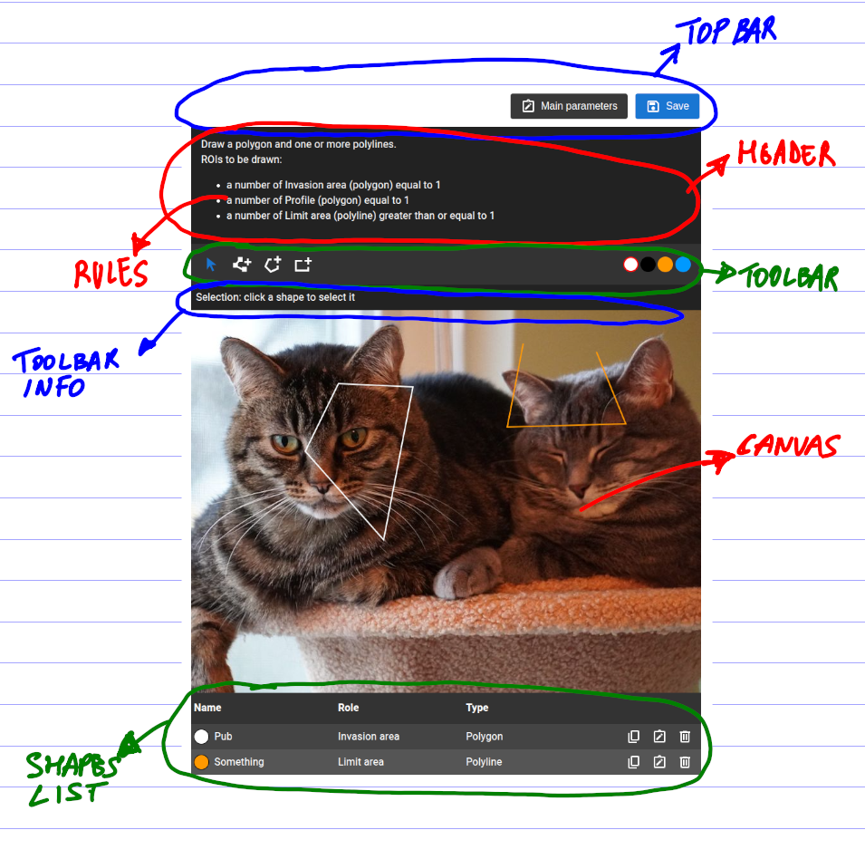

# React Cam ROI

This is a react component which lets you draw regions of interest (ROI) over images, manage metadata and import/export everything.  
Metadata are dynamic information that can be attached to the whole image and/or to each ROI. The number of drawable ROIs can also be configured.



It provides one component: `RoiEditor` and one provider: `UiProvider`. The editor lets you draw regions of interest over a given image (url). Each ROI can have dynamic metadata attached.

Export and import functionality is also provided.

Features:

- Autosizing of the editor: the canvas resizes to the size of the image, but it's also responsive, so if the container width is smaller, then the canvas is resized accordingly keeping the aspect ratio.
  (the size is adjusted on load, after will remain the same even if changing viewport size)
- Draw polylines, polygons and rectangles, change dimensions and rotate them.
- Support for number of drawable ROIs, defining a rule for each type.
- Support for dynamic metadata information attached to each shape and the whole image (with validation included).
- Import and export shapes and metadata in json format.
- Highly customizable: shape colors, custom components and css classes.

## Installation

```bash
npm install @abidibo/react-cam-roi
```

## Usage

```ts
import { RoiEditor, UiProvider, Types } from '@abidibo/react-cam-roi'
import { Typography, IconButton, Delete } from '@mui/material'
import '@abidibo/react-cam-roi/dist/index.esm.css' // !Important you must include the css

const MyComponent: React.FC = () => {
    const themMode = 'light'
    const config = {} // see below

    const handleSubmit = (data: Types.Output) =>  console.log(data) // onSubmit runs validation
    const handleUpdate = (data: Types.Output) =>  console.log(data) // onUpdate runs without validation

    return (
        <UiProvider themeMode={themeMode} IconButton={IconButton} Typography={Typography} DeleteIcon={() => <Delete />}>
          <RoiEditor imageUrl={'https://placecats.com/800/600'} configuration={config} onSubmit={handleSubmit} onUpdate={handleUpdate} />
        </UiProvider>
    )
}
```

The `RoiEditor` props and the `Output` interface used both in import and export:

```ts
export type RoiEditorProps = {
  // id of this editor instance, should be unique
  editorId: string
  // the url of the image we want to annotate
  imageUrl: string
  // configuration object
  configuration: Configuration
  // callback called when exporting data
  onSubmit: (data: Output) => void
  // initial imported data
  initialData?: Output
  // allow partial save: no error notified but errors are returned
  allowPartialSave?: boolean
  // slots for injecting components
  slots?: {
    // injected above ROIs section
    roiAbove?: React.ReactNode
  }
}

export const enum ToolEnum {
  Pointer = 'pointer',
  Point = 'point',
  Polyline = 'polyline',
  Polygon = 'polygon',
  Rectangle = 'rect',
}

export type ShapeType = ToolEnum.Polyline | ToolEnum.Polygon | ToolEnum.Rectangle | ToolEnum.Point

export type OutputShapePoint = {
  angle: number
  scaleX: number
  scaleY: number
  skewX: number
  skewY: number
  top: number
  left: number
  color: string
}

export type OutputShapeRect = {
  angle: number
  scaleX: number
  scaleY: number
  skewX: number
  skewY: number
  top: number
  left: number
  width: number
  height: number
  color: string
}

export type OutputShapePolyline = {
  angle: number
  scaleX: number
  scaleY: number
  skewX: number
  skewY: number
  points: { x: number; y: number }[]
  top: number
  left: number
  color: string
}

export type OutputShapePolygon = {
  angle: number
  scaleX: number
  scaleY: number
  skewX: number
  skewY: number
  points: { x: number; y: number }[]
  top: number
  left: number
  color: string
}

export type OutputPointCoords = {
  x: number
  y: number
}

export type OutputRectCoords = {
  points: { x: number; y: number }[]
}

export type OutputPolylineCoords = {
  points: { x: number; y: number }[]
}

export type OutputPolygonCoords = {
  points: { x: number; y: number }[]
}

export interface OutputParameter {
  codename: string
  value: number | string | boolean | string[] | number[] | null
}

export interface OutputRoi {
  parameters: OutputParameter[]
  type: ShapeType
  name: string
  role: string
  shape: OutputShapeRect | OutputShapePolyline | OutputShapePolygon | OutputShapePoint // fabric obj coords
  coords: OutputRectCoords | OutputPolylineCoords | OutputPolygonCoords | OutputPointCoords // canvas coords
}
export interface Output {
  parameters: OutputParameter[]
  presetName: string
  presetDescription: string
  rois: OutputRoi[]
  errors?: string[]
}
```

Take a look at the `UiProvider` allowed props (below) to see all the customization options.

## Configuration

The configuration prop defines which kind and how many ROIs can be drawn, along with metadata information. Here the types definitions and an example:

```ts
// All types can be imported:
// import { Types } from '@abidibo/react-cam-roi'
// const { ToolEnum, ShapeType, DataTypeEnum, OperatorEnum, ConfigurationParameter, RoiConfiguration, Configuration } = Types

// The drawable shapes plus the Pointer tool
export const enum ToolEnum {
  Pointer = 'pointer',
  Polyline = 'polyline',
  Polygon = 'polygon',
  Rectangle = 'rect',
}

// Allowed shape types
export type ShapeType = ToolEnum.Polyline | ToolEnum.Polygon | ToolEnum.Rectangle

// Data types allowed for metadata values
export enum DataTypeEnum {
  Integer = 'int',
  Float = 'float',
  String = 'string',
  Boolean = 'bool',
}

// Operators allowed for multiplicity (control how many shapes should/can be drawn)
export enum OperatorEnum {
  Lt = 'lt',
  Lte = 'lte',
  Gt = 'gt',
  Gte = 'gte',
  Eq = 'eq',
}

// Definition of a metadata parameter
export type ConfigurationParameter = {
  codename: string // unique
  label: string // label of the parameter
  description: string // helper text
  unit: string // postponed to the label
  type: DataTypeEnum // value type
  options: { value: number | string | boolean; label: string }[] // if filled the component will be a dropdown
  multiple?: boolean // for multiple selection
  required: boolean // required parameter
  value: number | string | boolean | string[] | number[] | null // default value
}

// Configuration of ROIs
export type RoiConfiguration = {
  role: string // let's say the category of the roi
  type: Omit<ShapeType, 'pointer'> // shape type
  multiplicity: { // how many ROIs of this type can be drawn
    operator: OperatorEnum
    threshold: number
  }
  parameters: ConfigurationParameter[] // ROIs parameters for this shape type
}

// Whole configuration
export type Configuration = {
  parameters: ConfigurationParameter[]
  rois: RoiConfiguration[]
  options: {
    hideForbiddenTools?: boolean // hide tools controllers for shapes that cannot be drawn
    description?: string // optional initial text shown in the editor
    viewMainParameters?: boolean // show main parameters readonly form
  }
}

// Example
export const configuration: Configuration = {
  parameters: [
    {
      codename: 'analytics_1', // internal code
      label: 'Analytics param 1', // to be shown in interface
      description: 'This is some descriptive text', // tooltip
      unit: 's', // unit
      type: DataTypeEnum.Integer, // int, float, string, bool
      options: [
        // if filled -> enum of types type
        {
          value: 7,
          label: 'Seven',
        },
        {
          value: 10,
          label: 'Ten',
        },
      ],
      required: true, // true | false,
      value: 10, // default value
    },
  ],
  rois: [
    {
      role: 'invasion_area', // analytics role
      type: ToolEnum.Polygon,
      multiplicity: {
        // how many rois of this type can/should be created
        operator: OperatorEnum.Lt, // lt | lte | gt | gte | eq
        threshold: 2,
      },
      parameters: [
        {
          codename: 'threshold', // internal code
          label: 'Alert threshold', // to be shown in interface
          description: 'Threshold used for triggering alarms', // tooltip
          unit: '%', // unit
          type: DataTypeEnum.Integer, // int, float, string, bool
          options: [],
          required: true, // true / false,
          value: null, // default value
        },
      ],
    },
  ],
  options?: {
    hideForbiddenTools?: boolean,
    description?: string,
    viewMainParameters?: boolean
  }
}
```

## UiProvider and Customization

You can customize many aspects of this library by using the `UiProvider`.

- You can customize both the styles and the components used in this library. The library provides default components with an interface almost compatible witu mui components (maybe you'll need to wrap some of them).
- You can override them by using the `UiProvider`. But you can also use the default ones and just add your styling.
- You can pass a theme mode which is used by the default components to determine the color scheme. It is also used to define custom classes you can use for styling.
- You can define a primary color which is used for color or background of active elements.
- You can define custom strings used here and there (some strings require one or more placeholders).
- You can enable logs in the console by setting the `enableLogs` option to `true`.

```tsx
import IconButton from '@mui/material/IconButton'
import { UiProvider, RoiEditor } from 'react-cam-roi'

const MyView: React.FC = () => {
  return (
    <UiProvider themeMode={'dark'} IconButton={IconButton} primaryColor={'#1976d2'} primaryFgColor={'#fff'} enableLogs>
      <RoiEditor imageUrl={'whatever'} />
    </UiProvider>
  )
}
```

### UiProvider

Props and types are defined later in this document.

```ts
type UiContextType = {
  children?: React.ReactNode
  enableLogs: boolean // enable console logs
  themeMode: 'light' | 'dark' // themeMode for internal components
  primaryColor: string // primary color for internal components
  primaryFgColor: string // text color above primary bg for internal components
  Typography: React.FC<TypographyProps> // component used to surround text
  Modal: React.FC<ModalProps> // modal dialog component (it displays metadata forms)
  IconButton: React.FC<IconButtonProps> // wrapper for icon buttons
  DeleteIcon: React.FC<DeleteIconProps> // delete icon
  CopyIcon: typeof CopyIcon // copy icon (clone a shape)
  AnnotateIcon: typeof AnnotateIcon // annotate icon (open metadata form)
  CloseIcon: typeof CloseIcon // close icon
  SaveIcon: typeof SaveIcon // save icon
  TextField: typeof TextField // field used for text input
  NumberField: typeof NumberField // field used for number input
  BoolField: typeof BoolField // field used for boolean input
  EnumField: typeof EnumField // field used for enum input (options filled in parameter definition)
  Button: typeof Button // button
  notify: INotify // function used to display notifications
  strings: {
    // strings used here and there
    cancel: string
    cannotDrawMorePoints: string
    cannotDrawMorePolygons: string
    cannotDrawMorePolylines: string
    cannotDrawMoreRectangles: string
    id: string
    invalidSubmission: string
    mainParametersMetadata: string
    missingPresetName: string
    missingRequiredValuesInMainParameters: string
    missingRequiredValuesInShapeParameters: string // with {id} placeholder
    mainParametersMetadata: strings
    name: string
    point: string
    pointHelpText: string
    polygon: string
    polygonHelpText: string
    polyline: string
    polylineHelpText: string
    pointer: string
    pointerHelpText: string
    presetDescription: string
    presetName: string
    rect: string
    rectHelpText: string
    requiredField: string
    roiMultiplicityEqRule: string // with {role}, {type} and {threshold} placeholder
    roiMultiplicityGtRule: string // with {role}, {type} and {threshold} placeholder
    roiMultiplicityGteRule: string // with {role}, {type} and {threshold} placeholder
    roiMultiplicityLtRule: string // with {role}, {type} and {threshold} placeholder
    roiMultiplicityLteRule: string // with {role}, {type} and {threshold} placeholder
    roiMultiplicityNoRule: string // with {role}, {type}
    roisToBeDrawn: string
    role: string
    save: string
    shapeParametersMetadata: string
    shapesOfRoleShouldBeEqualToThreshold: string // with {role} and {threshold} placeholders
    shapesOfRoleShouldBeGreaterThanThreshold: string // with {role} and {threshold} placeholders
    shapesOfRoleShouldBeGreaterThanOrEqualToThreshold: string // with {role} and {threshold} placeholders
    shapesOfRoleShouldBeLessThanThreshold: string // with {role} and {threshold} placeholders
    shapesOfRoleShouldBeLessThanOrEqualToThreshold: string // with {role} and {threshold} placeholders
    type: string
  }
}
```

### Components

Here comes the list of components you can override using the `UiProvider`.

#### Loader

##### Interface

```ts
type LoaderProps = {}
```

##### Classes

- `react-cam-roi-loader`
- `react-cam-roi-loader-light`
- `react-cam-roi-loader-dark`

#### Modal

##### Interface

```ts
type ModalProps = {
  children?: React.ReactNode
  title: string
  onClose: () => void
  isOpen: boolean
  maxWidth: 'xs' | 'sm' | 'md' | 'lg'
}
```

##### Classes

- `react-cam-roi-modal`
- `react-cam-roi-modal-light`
- `react-cam-roi-modal-dark`
- `react-cam-roi-modal-overlay`
- `react-cam-roi-modal-overlay-light`
- `react-cam-roi-modal-overlay-dark`
- `react-cam-roi-modal-header`
- `react-cam-roi-modal-header-light`
- `react-cam-roi-modal-header-dark`
- `react-cam-roi-modal-title`
- `react-cam-roi-modal-title-light`
- `react-cam-roi-modal-title-dark`
- `react-cam-roi-modal-footer`
- `react-cam-roi-modal-footer-light`
- `react-cam-roi-modal-footer-dark`

#### Typography

##### Interface

```ts
type TypographyProps = {
  children?: React.ReactNode
  variant?: any // compatible with mui
  component?: any // compatible with mui
  className?: string
  style?: React.CSSProperties
}
```

#### IconButton

##### Interface

```ts
type IconButtonProps = {
  children?: React.ReactNode
  disabled?: boolean
  onClick?: (event: React.MouseEvent) => void
}
```

##### Classes

- `react-cam-roi-icon-button`
- `react-cam-roi-icon-button-light`
- `react-cam-roi-icon-button-dark`
- `react-cam-roi-icon-button-disabled`

#### DeleteIcon

##### Interface

```ts
type DeleteIconProps = {
  color?: string
  style?: React.CSSProperties
}
```

#### EditIcon

##### Interface

```ts
type EditIconProps = {
  color?: string
  style?: React.CSSProperties
}
```

#### CopyIcon

##### Interface

```ts
type CopyIconProps = {
  color?: string
  style?: React.CSSProperties
}
```

#### AnnotateIcon

##### Interface

```ts
type AnnotateIconProps = {
  color?: string
  style?: React.CSSProperties
}
```

#### SaveIcon

##### Interface

```ts
type SaveIconProps = {
  color?: string
  style?: React.CSSProperties
}
```

#### TextField

##### Interface

```ts
type TextFieldProps = {
  type?: 'text' | 'email' | 'password'
  onChange: (value: string) => void
  value: string
  label: string
  helperText?: string
  error?: boolean
  required?: boolean
  readOnly?: boolean
  disabled?: boolean
  fullWidth?: boolean
}
```

##### Classes

- `react-cam-roi-text-field-wrapper`
- `react-cam-roi-text-field-wrapper-light`
- `react-cam-roi-text-field-wrapper-dark`
- `react-cam-roi-text-field`
- `react-cam-roi-text-field--light`
- `react-cam-roi-text-field--dark`
- `react-cam-roi-text-field--error`
- `react-cam-roi-text-field-label`
- `react-cam-roi-text-field-label-light`
- `react-cam-roi-text-field-label-dark`
- `react-cam-roi-text-field-label-error`
- `react-cam-roi-text-field-helper-text`
- `react-cam-roi-text-field-helper-text-light`
- `react-cam-roi-text-field-helper-text-dark`
- `react-cam-roi-text-field-helper-text-error`

#### NumberField

##### Interface

```ts
type NumberFieldProps = {
  onChange: (value: number) => void
  value: number
  label: string
  helperText?: string
  error?: boolean
  required?: boolean
  readOnly?: boolean
  disabled?: boolean
}
```

##### Classes

- `react-cam-roi-number-field-wrapper`
- `react-cam-roi-number-field-wrapper-light`
- `react-cam-roi-number-field-wrapper-dark`
- `react-cam-roi-number-field`
- `react-cam-roi-number-field--light`
- `react-cam-roi-number-field--dark`
- `react-cam-roi-number-field--error`
- `react-cam-roi-number-field-label`
- `react-cam-roi-number-field-label-light`
- `react-cam-roi-number-field-label-dark`
- `react-cam-roi-number-field-label-error`
- `react-cam-roi-number-field-helper-text`
- `react-cam-roi-number-field-helper-text-light`
- `react-cam-roi-number-field-helper-text-dark`
- `react-cam-roi-number-field-helper-text-error`

#### BoolField

##### Interface

```ts
type BoolFieldProps = {
  onChange: (value: boolean) => void
  value: boolean
  label: string
  helperText?: string
  error?: boolean
  required?: boolean
  readOnly?: boolean
  disabled?: boolean
}
```

##### Classes

- `react-cam-roi-bool-field-wrapper`
- `react-cam-roi-bool-field-wrapper-light`
- `react-cam-roi-bool-field-wrapper-dark`
- `react-cam-roi-bool-field`
- `react-cam-roi-bool-field--light`
- `react-cam-roi-bool-field--dark`
- `react-cam-roi-bool-field--error`
- `react-cam-roi-bool-field-label`
- `react-cam-roi-bool-field-label-light`
- `react-cam-roi-bool-field-label-dark`
- `react-cam-roi-bool-field-label-error`
- `react-cam-roi-bool-field-helper-text`
- `react-cam-roi-bool-field-helper-text-light`
- `react-cam-roi-bool-field-helper-text-dark`
- `react-cam-roi-bool-field-helper-text-error`

#### EnumField

##### Interface

```ts
type EnumFieldProps = {
  onChange: (value: string | number | (string | number)[]) => void
  value: string | number | (string | number)[]
  label: string
  helperText?: string
  error?: boolean
  required?: boolean
  multiple?: boolean
  disabled?: boolean
}
```

##### Classes

- `react-cam-roi-enum-field-wrapper`
- `react-cam-roi-enum-field-wrapper-light`
- `react-cam-roi-enum-field-wrapper-dark`
- `react-cam-roi-enum-field`
- `react-cam-roi-enum-field--light`
- `react-cam-roi-enum-field--dark`
- `react-cam-roi-enum-field--error`
- `react-cam-roi-enum-field-label`
- `react-cam-roi-enum-field-label-light`
- `react-cam-roi-enum-field-label-dark`
- `react-cam-roi-enum-field-label-error`
- `react-cam-roi-enum-field-helper-text`
- `react-cam-roi-enum-field-helper-text-light`
- `react-cam-roi-enum-field-helper-text-dark`
- `react-cam-roi-enum-field-helper-text-error`

#### Button

##### Interface

```ts
type ButtonProps = {
  onClick: (event: React.MouseEvent) => void
  primary?: boolean
  disabled?: boolean
}
```

##### Classes

- `react-cam-roi-button`
- `react-cam-roi-button-light`
- `react-cam-roi-button-dark`
- `react-cam-roi-button-disabled`
- `react-cam-roi-button-disabled-light`
- `react-cam-roi-button-disabled-dark`

### Functions

```ts
type INotify = {
  // compatible with toast (react-toastify)
  info: (message: string) => void
  warn: (message: string) => void
  error: (message: string) => void
  success: (message: string) => void
}
```

### Styles

There are components that cannot be overridden. But still you can use classes to style them.

#### Top bar

- `react-cam-roi-top-bar`
- `react-cam-roi-top-bar-light`
- `react-cam-roi-top-bar-dark`

#### Main parameters view

- `react-cam-roi-main-parameters-view`
- `react-cam-roi-main-parameters-view-light`
- `react-cam-roi-main-parameters-view-dark`
- `react-cam-roi-main-parameters-button`
- `react-cam-roi-main-parameters-button-light`
- `react-cam-roi-main-parameters-button-dark`

#### ROIs editor wrapper

- `react-cam-roi-rois-wrapper`
- `react-cam-roi-rois-wrapper-light`
- `react-cam-roi-rois-wrapper-dark`

#### Canvas wrapper

- `react-cam-roi-canvas-wrapper`
- `react-cam-roi-canvas-wrapper-light`
- `react-cam-roi-canvas-wrapper-dark`

#### Header

- `react-cam-roi-header`
- `react-cam-roi-header-light`
- `react-cam-roi-header-dark`

- `react-cam-roi-header-info`
- `react-cam-roi-header-info-light`
- `react-cam-roi-header-info-dark`

#### Toolbar

- `react-cam-roi-toolbar`
- `react-cam-roi-toolbar-light`
- `react-cam-roi-toolbar-dark`

- `react-cam-roi-toolbar-spacer`
- `react-cam-roi-toolbar-spacer-light`
- `react-cam-roi-toolbar-spacer-dark`

#### Toolbar help text

- `react-cam-roi-toolbar-helper`
- `react-cam-roi-toolbar-helper-light`
- `react-cam-roi-toolbar-helper-dark`

#### Shapes list

- `react-cam-roi-shapes-table`
- `react-cam-roi-shapes-table-light`
- `react-cam-roi-shapes-table-dark`
- `react-cam-roi-shapes-row-selected-light`
- `react-cam-roi-shapes-row-selected-dark`
- `react-cam-roi-shapes-row-even-light`
- `react-cam-roi-shapes-row-even-dark`
- `react-cam-roi-shapes-row-odd-light`
- `react-cam-roi-shapes-row-odd-dark`

#### Colorpicker button

- `react-cam-roi-colorpicker-button`
- `react-cam-roi-colorpicker-button-light`
- `react-cam-roi-colorpicker-button-dark`

- `react-cam-roi-colorpicker-button-active`
- `react-cam-roi-colorpicker-button-active-light`
- `react-cam-roi-colorpicker-button-active-dark`

#### Form

- `react-cam-roi-form`

## Development

After cloning the repository and install dependencies (`yarn install`), you can run the following commands:

| Command          | Description           |
| ---------------- | --------------------- |
| `yarn clean`     | Clean the dist folder |
| `yarn build`     | Build the library     |
| `yarn storybook` | Run storybook         |

In order to start developing just run the storybook, then make changes to code and the storybook will be updated.

In order to test the library in onother local react project you can:

```bash
cd react-cam-roi
yarn link
cd ../my-project
yarn link @abidibo/react-cam-roi
```

Then rebuild this library to see your changes in the project.

## CI

A github action pipeline is provided, which is triggered by every push to the main branch.  
The pipeline will publish the package to npm and update the CHANGELOG following the [conventional commits](https://www.conventionalcommits.org/en/v1.0.0/).  
You need to add the `NODE_AUTH_TOKEN` and `GH_TOKEN` secrets to your repository settings, see [semantic-release](https://github.com/semantic-release/semantic-release) for more information.
